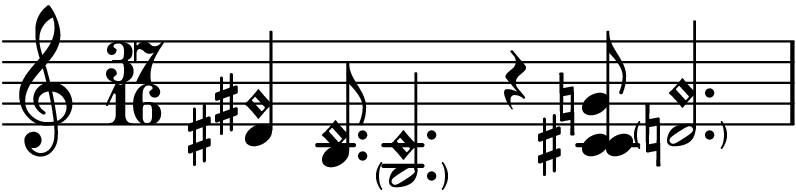
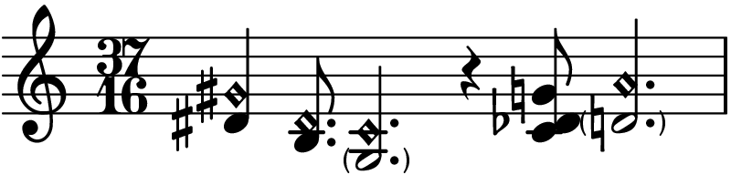
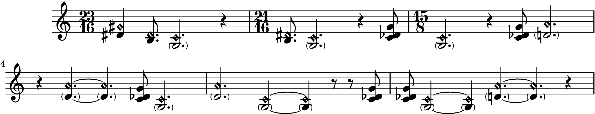
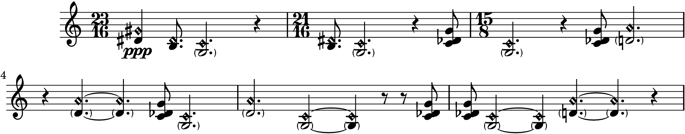
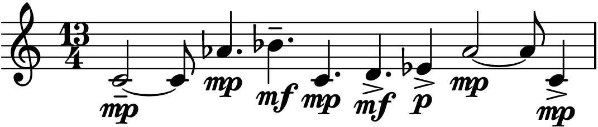
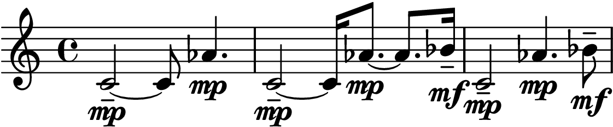
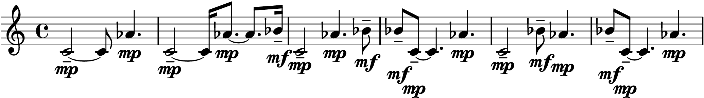
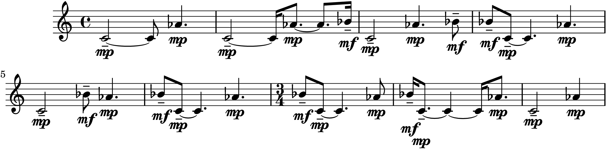
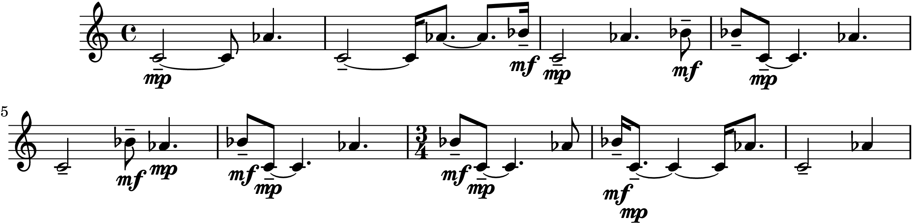

.. auxjad documentation master file, created by
   sphinx-quickstart on Mon Dec  3 00:15:26 2018.
   You can adapt this file completely to your liking, but it should at least
   contain the root `toctree` directive.

Examples of usage
=================

In this page there are two more complex examples showcasing the types of
manipulation that ``auxjad``'s functions and classes can accomplish. These
examples do not make use of all functions and classes, nor does it show all the
features of the used ones. Please refer to ``auxjad``'s API in the left pane
for the documentation of specific functions and classes.

Example 1
---------

In this second example, we will use some of ``auxjad``'s' classes to manipulate
some musical material using the looping and shuffling classes.

First, we start by importing both ``abjad`` and ``auxjad``.

    >>> import abjad
    >>> import auxjad

Let's now create a container with some arbitrary material to be manipulated.
Let's use the class ``auxjad.ArtificialHarmonic`` as well as some chords and
rests.

    >>> container = abjad.Staff([
    ...     auxjad.ArtificialHarmonic("<ds' gs'>4"),
    ...     auxjad.ArtificialHarmonic("<b ds'>8."),
    ...     auxjad.ArtificialHarmonic("<g c'>2.", is_parenthesized=True),
    ...     abjad.Rest("r4"),
    ...     abjad.Chord([0, 1, 7], (1, 8)),
    ...     auxjad.ArtificialHarmonic("<d' a'>2.", is_parenthesized=True),
    ... ])

Let's now add a time signature of the length of the container.

    >>> container_length = abjad.inspect(container).duration()
    >>> abjad.attach(abjad.TimeSignature(container_length), container[0])
    >>> abjad.f(container)
    \new Staff
    {
        \time 37/16
        <
            ds'
            \tweak style #'harmonic
            gs'
        >4
        <
            b
            \tweak style #'harmonic
            ds'
        >8.
        <
            \parenthesize
            \tweak ParenthesesItem.font-size #-4
            g
            \tweak style #'harmonic
            c'
        >2.
        r4
        <c' cs' g'>8
        <
            \parenthesize
            \tweak ParenthesesItem.font-size #-4
            d'
            \tweak style #'harmonic
            a'
        >2.
    }

The spelling of the chord ``<c' cs' g'>`` could be improved. This can be done
using either ``auxjad.respell_chord`` or ``auxjad.respell_container``.

    >>> auxjad.respell_container(container)
    >>> abjad.f(container)
    \new Staff
    {
        \time 37/16
        <
            ds'
            \tweak style #'harmonic
            gs'
        >4
        <
            b
            \tweak style #'harmonic
            ds'
        >8.
        <
            \parenthesize
            \tweak ParenthesesItem.font-size #-4
            g
            \tweak style #'harmonic
            c'
        >2.
        r4
        <c' df' g'>8
        <
            \parenthesize
            \tweak ParenthesesItem.font-size #-4
            d'
            \tweak style #'harmonic
            a'
        >2.
    }

Let's now use this material as input for ``auxjad.LoopWindowByElements``. This
is one of the many loopers included in ``auxjad``. It works by selecting groups
of _n_ elements (given by the argument ``window_size``). With ``window_size``
set to 4, this looper will first output the first four elements, then output
elements 2 through 5, then 3 through 6, and so on.

    >>> looper = auxjad.LoopWindowByElements(container, window_size=4)
    >>> staff = abjad.Staff()
    >>> for _ in range(3):
    ...     music = looper()
    ...     staff.append(music)
    >>> abjad.f(staff)
    \new Staff
    {
        \time 23/16
        <
            ds'
            \tweak style #'harmonic
            gs'
        >4
        <
            b
            \tweak style #'harmonic
            ds'
        >8.
        <
            \parenthesize
            \tweak ParenthesesItem.font-size #-4
            g
            \tweak style #'harmonic
            c'
        >2.
        r4
        \time 21/16
        <
            b
            \tweak style #'harmonic
            ds'
        >8.
        <
            \parenthesize
            \tweak ParenthesesItem.font-size #-4
            g
            \tweak style #'harmonic
            c'
        >2.
        r4
        <c' df' g'>8
        \time 15/8
        <
            \parenthesize
            \tweak ParenthesesItem.font-size #-4
            g
            \tweak style #'harmonic
            c'
        >2.
        r4
        <c' df' g'>8
        <
            \parenthesize
            \tweak ParenthesesItem.font-size #-4
            d'
            \tweak style #'harmonic
            a'
        >2.
    }

.. figure:: ./_images_examples/image-example-1-3.png

Let's now grab the last window output by the looper object above and use it as
input for ``auxjad.LeafShuffler``. This will randomly shuffles the leaves of
the input container.

    >>> container = abjad.Container(looper.current_window)
    >>> shuffler = auxjad.LeafShuffler(container, omit_time_signatures=True)
    >>> for _ in range(3):
    ...     music = shuffler()
    ...     staff.append(music)
    >>> abjad.f(staff)
    \new Staff
    {
        \time 23/16
        <
            ds'
            \tweak style #'harmonic
            gs'
        >4
        <
            b
            \tweak style #'harmonic
            ds'
        >8.
        <
            \parenthesize
            \tweak ParenthesesItem.font-size #-4
            g
            \tweak style #'harmonic
            c'
        >2.
        r4
        \time 21/16
        <
            b
            \tweak style #'harmonic
            ds'
        >8.
        <
            \parenthesize
            \tweak ParenthesesItem.font-size #-4
            g
            \tweak style #'harmonic
            c'
        >2.
        r4
        <c' df' g'>8
        \time 15/8
        <
            \parenthesize
            \tweak ParenthesesItem.font-size #-4
            g
            \tweak style #'harmonic
            c'
        >2.
        r4
        <c' df' g'>8
        <
            \parenthesize
            \tweak ParenthesesItem.font-size #-4
            d'
            \tweak style #'harmonic
            a'
        >2.
        r4
        <
            \parenthesize
            \tweak ParenthesesItem.font-size #-4
            d'
            \tweak style #'harmonic
            a'
        >4.
        ~
        <
            \parenthesize
            \tweak ParenthesesItem.font-size #-4
            d'
            \tweak style #'harmonic
            a'
        >4.
        <c' df' g'>8
        <
            \parenthesize
            \tweak ParenthesesItem.font-size #-4
            g
            \tweak style #'harmonic
            c'
        >2.
        <
            \parenthesize
            \tweak ParenthesesItem.font-size #-4
            d'
            \tweak style #'harmonic
            a'
        >2.
        <
            \parenthesize
            \tweak ParenthesesItem.font-size #-4
            g
            \tweak style #'harmonic
            c'
        >2
        ~
        <
            \parenthesize
            \tweak ParenthesesItem.font-size #-4
            g
            \tweak style #'harmonic
            c'
        >4
        r8
        r8
        <c' df' g'>8
        <c' df' g'>8
        <
            \parenthesize
            \tweak ParenthesesItem.font-size #-4
            g
            \tweak style #'harmonic
            c'
        >2
        ~
        <
            \parenthesize
            \tweak ParenthesesItem.font-size #-4
            g
            \tweak style #'harmonic
            c'
        >4
        <
            \parenthesize
            \tweak ParenthesesItem.font-size #-4
            d'
            \tweak style #'harmonic
            a'
        >4.
        ~
        <
            \parenthesize
            \tweak ParenthesesItem.font-size #-4
            d'
            \tweak style #'harmonic
            a'
        >4.
        r4
    }

To finalise the score, let's add an initial dynamic to the first leaf of the
staff.

    >>> abjad.attach(abjad.Dynamic('ppp'), staff[0])
    >>> abjad.f(staff)
    \new Staff
    {
        \time 23/16
        <
            ds'
            \tweak style #'harmonic
            gs'
        >4
        \ppp
        <
            b
            \tweak style #'harmonic
            ds'
        >8.
        <
            \parenthesize
            \tweak ParenthesesItem.font-size #-4
            g
            \tweak style #'harmonic
            c'
        >2.
        r4
        \time 21/16
        <
            b
            \tweak style #'harmonic
            ds'
        >8.
        <
            \parenthesize
            \tweak ParenthesesItem.font-size #-4
            g
            \tweak style #'harmonic
            c'
        >2.
        r4
        <c' df' g'>8
        \time 15/8
        <
            \parenthesize
            \tweak ParenthesesItem.font-size #-4
            g
            \tweak style #'harmonic
            c'
        >2.
        r4
        <c' df' g'>8
        <
            \parenthesize
            \tweak ParenthesesItem.font-size #-4
            d'
            \tweak style #'harmonic
            a'
        >2.
        r4
        <
            \parenthesize
            \tweak ParenthesesItem.font-size #-4
            d'
            \tweak style #'harmonic
            a'
        >4.
        ~
        <
            \parenthesize
            \tweak ParenthesesItem.font-size #-4
            d'
            \tweak style #'harmonic
            a'
        >4.
        <c' df' g'>8
        <
            \parenthesize
            \tweak ParenthesesItem.font-size #-4
            g
            \tweak style #'harmonic
            c'
        >2.
        <
            \parenthesize
            \tweak ParenthesesItem.font-size #-4
            d'
            \tweak style #'harmonic
            a'
        >2.
        <
            \parenthesize
            \tweak ParenthesesItem.font-size #-4
            g
            \tweak style #'harmonic
            c'
        >2
        ~
        <
            \parenthesize
            \tweak ParenthesesItem.font-size #-4
            g
            \tweak style #'harmonic
            c'
        >4
        r8
        r8
        <c' df' g'>8
        <c' df' g'>8
        <
            \parenthesize
            \tweak ParenthesesItem.font-size #-4
            g
            \tweak style #'harmonic
            c'
        >2
        ~
        <
            \parenthesize
            \tweak ParenthesesItem.font-size #-4
            g
            \tweak style #'harmonic
            c'
        >4
        <
            \parenthesize
            \tweak ParenthesesItem.font-size #-4
            d'
            \tweak style #'harmonic
            a'
        >4.
        ~
        <
            \parenthesize
            \tweak ParenthesesItem.font-size #-4
            d'
            \tweak style #'harmonic
            a'
        >4.
        r4
    }

Example 2
---------

In this second example, we will use some of ``auxjad``'s' classes to generate
a container of randomly selected material, and then use this material as input
for the looping and shuffling classes.

First, we start by importing both ``abjad`` and ``auxjad``.

    >>> import abjad
    >>> import auxjad

Let's start by deciding what random generator functions will be responsible for
creating each parameter of the basic material. Let's use
``auxjad.TenneysContainer`` for pitches, which is an implementation of Tenney's
Dissonant Counterpoint Algorithm; at each call, this algorithm prioritises
elements that haven't been select for the longest time. For the durations,
dynamics, and articulations, the example will use
``auxjad.CartographyContainer``. Each element in this type of container has a
probability of being selected which is dependent on its position in the
container. By default, the probability of consecutive elements decay with a
rate of 0.75. For more information on both of these classes, check the
``auxjad`` API page (link in the left panel).

    >>> pitch_container = auxjad.TenneysContainer([0, 7, 8, 2, 3, 10])
    >>> duration_container = auxjad.CartographyContainer([(2, 8),
    ...                                                   (3, 8),
    ...                                                   (5, 8),
    ...                                                   ])
    >>> dynamic_container = auxjad.CartographyContainer(['p', 'mp', 'mf', 'f'])
    >>> articulation_container = auxjad.CartographyContainer([None, '-', '>'])

Let's now create eight random notes, each with four parameters randomly
selected by the classes above.

    >>> pitches = [pitch_container() for _ in range(8)]
    >>> durations = [duration_container() for _ in range(8)]
    >>> dynamics = [dynamic_container() for _ in range(8)]
    >>> articulations = [articulation_container() for _ in range(8)]

With these lists of pitches, durations, dynamics, and articulations, we can now
use ``auxjad.LeafDynMaker`` to create the individual abjad leaves for us.

    >>> leaf_dyn_maker = auxjad.LeafDynMaker()
    >>> notes = leaf_dyn_maker(pitches, durations, dynamics, articulations)
    >>> container = abjad.Staff(notes)

Let's now add a time signature of the length of the container.

    >>> container_length = abjad.inspect(container).duration()
    >>> abjad.attach(abjad.TimeSignature(container_length), container[0])
    >>> abjad.f(container)
    \new Staff
    {
        \time 13/4
        c'2
        \mp
        - \tenuto
        ~
        c'8
        af'4.
        \mp
        bf'4.
        \mf
        - \tenuto
        c'4.
        \mp
        d'4.
        \mf
        - \accent
        ef'4
        \p
        - \accent
        af'2
        \mp
        ~
        af'8
        c'4
        \mp
        - \accent
    }

Let's now use ``auxjad.LoopWindow`` to output loops of windows of the material.
By default, this class uses a window size of a 4/4 measure, and each step
forward has the size of a sixteenth-note. These parameters are all adjustable,
please refer to this library's API for more information.

    >>> looper = auxjad.LoopWindow(container)
    >>> staff = abjad.Staff()
    >>> for _ in range(3):
    >>>     music = looper()
    >>>     staff.append(music)
    >>> abjad.f(staff)
    \new Staff
    {
        \time 4/4
        c'2
        \mp
        - \tenuto
        ~
        c'8
        af'4.
        \mp
        c'2
        \mp
        - \tenuto
        ~
        c'16
        af'8.
        \mp
        ~
        af'8.
        bf'16
        \mf
        - \tenuto
        c'2
        \mp
        - \tenuto
        af'4.
        \mp
        bf'8
        \mf
        - \tenuto
    }

Let's now grab the last window output by the looper object above and use it as
input for ``auxjad.LeafShuffler``. This will randomly shuffles the leaves of
the input container.

    >>> container = abjad.Container(looper.current_window)
    >>> shuffler = auxjad.LeafShuffler(container, omit_time_signatures=True)
    >>> for _ in range(3):
    >>>     music = shuffler()
    >>>     staff.append(music)
    >>> abjad.f(staff)
    \new Staff
    {
        \time 4/4
        c'2
        \mp
        - \tenuto
        ~
        c'8
        af'4.
        \mp
        c'2
        \mp
        - \tenuto
        ~
        c'16
        af'8.
        \mp
        ~
        af'8.
        bf'16
        \mf
        - \tenuto
        c'2
        \mp
        - \tenuto
        af'4.
        \mp
        bf'8
        \mf
        - \tenuto
        bf'8
        \mf
        - \tenuto
        c'8
        \mp
        - \tenuto
        ~
        c'4.
        af'4.
        \mp
        c'2
        \mp
        - \tenuto
        bf'8
        \mf
        - \tenuto
        af'4.
        \mp
        bf'8
        \mf
        - \tenuto
        c'8
        \mp
        - \tenuto
        ~
        c'4.
        af'4.
        \mp
    }

Let's use the last output of the shuffler above and feed it into a new looper.
This time we will use a window of size 3/4.

    >>> container = abjad.Container(shuffler.current_container)
    >>> looper = auxjad.LoopWindow(container,
    ...                            window_size=(3, 4),
    ...                            )
    >>> for _ in range(3):
    >>>     music = looper()
    >>>     staff.append(music)
    >>> abjad.f(staff)
    \new Staff
    {
        \time 4/4
        c'2
        \mp
        - \tenuto
        ~
        c'8
        af'4.
        \mp
        c'2
        \mp
        - \tenuto
        ~
        c'16
        af'8.
        \mp
        ~
        af'8.
        bf'16
        \mf
        - \tenuto
        c'2
        \mp
        - \tenuto
        af'4.
        \mp
        bf'8
        \mf
        - \tenuto
        bf'8
        \mf
        - \tenuto
        c'8
        \mp
        - \tenuto
        ~
        c'4.
        af'4.
        \mp
        c'2
        \mp
        - \tenuto
        bf'8
        \mf
        - \tenuto
        af'4.
        \mp
        bf'8
        \mf
        - \tenuto
        c'8
        \mp
        - \tenuto
        ~
        c'4.
        af'4.
        \mp
        \time 3/4
        bf'8
        \mf
        - \tenuto
        c'8
        \mp
        - \tenuto
        ~
        c'4.
        af'8
        \mp
        bf'16
        \mf
        - \tenuto
        c'8.
        \mp
        - \tenuto
        ~
        c'4
        ~
        c'16
        af'8.
        \mp
        c'2
        \mp
        - \tenuto
        af'4
        \mp
    }

At this point, let's use ``auxjad.remove_repeated_dynamics`` to remove all
repeated dyanmics. The final result is shown below.

    >>> auxjad.remove_repeated_dynamics(staff)
    >>> abjad.f(staff)
    \new Staff
    {
        \time 4/4
        c'2
        \mp
        - \tenuto
        ~
        c'8
        af'4.
        c'2
        - \tenuto
        ~
        c'16
        af'8.
        ~
        af'8.
        bf'16
        \mf
        - \tenuto
        c'2
        \mp
        - \tenuto
        af'4.
        bf'8
        \mf
        - \tenuto
        bf'8
        - \tenuto
        c'8
        \mp
        - \tenuto
        ~
        c'4.
        af'4.
        c'2
        - \tenuto
        bf'8
        \mf
        - \tenuto
        af'4.
        \mp
        bf'8
        \mf
        - \tenuto
        c'8
        \mp
        - \tenuto
        ~
        c'4.
        af'4.
        \time 3/4
        bf'8
        \mf
        - \tenuto
        c'8
        \mp
        - \tenuto
        ~
        c'4.
        af'8
        bf'16
        \mf
        - \tenuto
        c'8.
        \mp
        - \tenuto
        ~
        c'4
        ~
        c'16
        af'8.
        c'2
        - \tenuto
        af'4
    }

